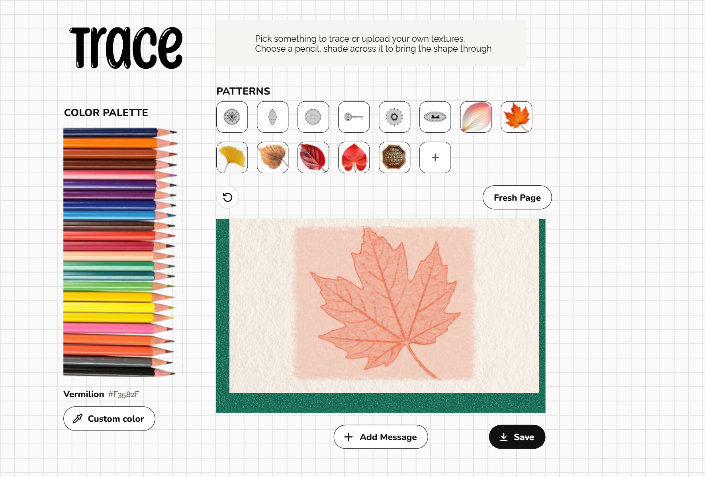

# Trace

**A pencil-rubbing studio in the browser.** Slip a coin, a leaf, a key or a royal seal under the paper, pick a coloured pencil, and shade across the sheet until the shape comes through, just like rubbing a coin with a pencil as a kid.



---

## About

Trace recreates the small, tactile joy of a pencil rubbing. You don't draw the picture; you uncover it. Every pattern sits hidden beneath a sheet of textured paper. As you shade, the pencil catches on the raised edges and the image slowly surfaces: the rim of a coin, the veins of a maple leaf, the Devanagari lettering of Shivaji Maharaj's *Rajmudra*.

The interface is laid out like a desk: a sheet of graph paper, a stack of colour pencils down the left edge, a row of objects to trace, and a clipped sheet of cold-press paper on a green board. When the imprint is complete, a small celebration pops up. You can then print a message on your rubbing and save it as an image to share.

## Features

- **Patterns to trace:** a coin, a leaf, a button, a key, a sun medallion, a pressed souvenir penny, photographed leaves (maple, ginkgo, poplar and more), and the Rajmudra royal seal.
- **Upload your own:** any photo becomes a rubbable relief. Trace turns its edges and textures into raised lines.
- **24-pencil colour rack:** the chosen pencil slides out toward the paper. A custom colour picker covers every other shade.
- **Natural shading:** a light pencil touch with hatch-like strokes. A pencil follows your cursor with its tip on the point you're shading.
- **Undo and Fresh Page:** step back a stroke or start over.
- **Celebration:** confetti in the pencil colours when the full imprint comes through.
- **Messages on the sheet:** type a message that's printed right on the rubbing. Drag it to move it, drag a side to change its width, or drag a corner to resize it. Choose from 16 typefaces and any colour.
- **Claude-written messages:** when Trace runs as an artifact on claude.ai, Claude can draft a short message for any occasion.
- **Save:** export the finished card as a PNG: 1280 × 720 on larger screens, 720 × 1280 on phones.
- **Responsive:** on phones the sheet turns portrait (9:16), the pencil rack becomes a row of upright pencils scaled to fit the screen, and buttons get more compact.

## How the rubbing works

A real rubbing darkens where the object is raised and stays pale where it's recessed, and the pencil picks up the paper's own grain. Trace models that with layered canvases that are combined every time you shade:

| Layer | What it holds |
| --- | --- |
| **Relief** | How raised each point of the pattern is. Drawn objects are stored as line art. Uploaded photos go through Sobel edge detection, so strong edges rub dark and flat areas stay light. The bare paper takes a light 25% of the pigment, so every stroke still marks the sheet. |
| **Strokes** | Your pencil marks, laid down as small, slightly randomised hatch lines that follow the direction of your drag. |
| **Paper tooth** | A grain map from a real cold-press sheet. Graphite catches the raised grain and skips the hollows. |
| **Paper** | The photographed sheet, warmed to a soft cream. |

What you see is **strokes × relief × paper tooth**, multiplied onto the paper. The relief sets a ceiling for each spot, so shading harder only fills the raised areas more completely. Fine detail, like the Rajmudra's lettering, stays readable however much you rub.

## Tech stack

Trace is built with plain web technologies: no frameworks, no libraries, no build step. The whole app is a single `index.html`.

**Markup & styling**
- **HTML5**: semantic structure (`main`, `aside`, `section`), inline SVG for the drawing pencil, icons and paper clip
- **CSS3**:
  - custom properties (design tokens)
  - CSS Grid with named areas for the page layout, and Flexbox for controls
  - media queries for the phone layout
  - keyframe animations for the celebration and confetti, plus `prefers-reduced-motion` support
  - transforms: the pencil rack rotates into an upright row on phones
  - gradients: the graph-paper background is drawn entirely in CSS
  - an SVG `feTurbulence` filter for the textured green board

**Graphics: Canvas 2D API**
- Offscreen canvases for the relief, stroke, paper-tooth and grain layers
- Compositing modes (`multiply`, `destination-in`, `copy`) to combine the layers
- Pixel-level processing with `getImageData` / `putImageData`: Sobel edge detection for uploaded photos, and contrast and tooth mapping for the paper
- `devicePixelRatio`-aware rendering for sharp results on high-density screens
- `toBlob` for PNG export

**Interaction: vanilla JavaScript (ES2020+)**
- **Pointer Events** with pointer capture for mouse, touch and pen input
- A resizable, draggable text frame with hit-testing for its move, side and corner handles
- `FileReader` for photo uploads; `Blob` and object URLs for downloads

**Assets & fonts**
- Images (pencil rack, leaf photographs, paper texture, logo) embedded as Base64 data URIs in WebP, PNG and JPEG, so the page is fully self-contained
- **Nunito** and **Raleway** from Google Fonts for the interface, plus 16 display and handwriting fonts for messages

**Integrations**
- **Claude artifact runtime** (`window.claude.use`): Claude-written messages and in-app downloads when hosted on claude.ai

**Design**
- Designed in **Figma**

## Project structure

```
trace/
├── index.html          the whole app: markup, styles, script and embedded images
├── docs/
│   └── screenshot.png  preview image for this README
└── README.md
```

---

Designed and built by **[Neha Sadaye](https://github.com/nehasadaye11)** (@nehasadaye11).

If you fork, copy or replicate this repository, please mention the owner, Neha Sadaye (@nehasadaye11), and link back to this repo.
